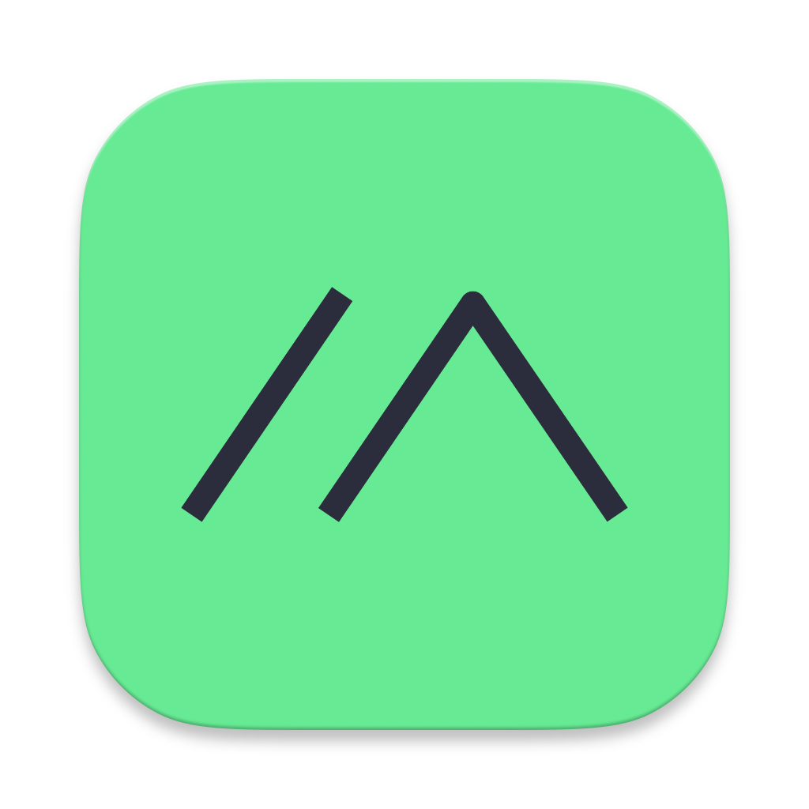

# Meshtastic DM Relay Custom Firmware

This is a custom fork of the Meshtastic firmware that includes the **DM Relay Module**. This module intercepts incoming Direct Messages (DMs) from favorite nodes and rebroadcasts them to the local mesh on Channel 0 with a restricted hop count of 1.

## Custom Build Instructions

To compile this custom firmware for the Heltec MeshPocket 10000mAh (using Windows/PowerShell):

```powershell
# Install or update PlatformIO
python -m pip install -U platformio

# Set a temporary workspace directory to avoid long path issues
$env:PLATFORMIO_WORKSPACE_DIR = "$env:TEMP\meshtastic_pio"

# Optional: Set the hop count for the rebroadcasted message (default is 1)
$env:PLATFORMIO_BUILD_FLAGS = "-DDM_RELAY_HOP_LIMIT=3"

# Compile for the Heltec MeshPocket 10000mAh
python -m platformio run -e heltec-mesh-pocket-10000
```

After compilation, the new firmware file will be located at `$env:TEMP\meshtastic_pio\build\heltec-mesh-pocket-10000\firmware.uf2`.

### Flashing Instructions
1. Connect the Heltec Meshpocket to your PC via USB.
2. Double-click the reset button on the device to enter DFU mode.
3. A new USB drive should appear (usually named `NRF52BOOT`).
4. Drag and drop `firmware.uf2` into that USB drive.

---

<div align="center" markdown="1">


<h1>Meshtastic Firmware</h1>


[](https://github.com/meshtastic/firmware/actions/workflows/ci.yml)
[](https://cla-assistant.io/meshtastic/firmware)
[](https://opencollective.com/meshtastic/)
[](https://vercel.com?utm_source=meshtastic&utm_campaign=oss)

<a href="https://trendshift.io/repositories/5524" target="_blank"></a>

</div>

</div>

<div align="center">
	<a href="https://meshtastic.org">Website</a>
	-
	<a href="https://meshtastic.org/docs/">Documentation</a>
</div>

## Overview

This repository contains the official device firmware for Meshtastic, an open-source LoRa mesh networking project designed for long-range, low-power communication without relying on internet or cellular infrastructure. The firmware supports various hardware platforms, including ESP32, nRF52, RP2040/RP2350, and Linux-based devices.

Meshtastic enables text messaging, location sharing, and telemetry over a decentralized mesh network, making it ideal for outdoor adventures, emergency preparedness, and remote operations.

### Get Started

- 🔧 **[Building Instructions](https://meshtastic.org/docs/development/firmware/build)** – Learn how to compile the firmware from source.
- ⚡ **[Flashing Instructions](https://meshtastic.org/docs/getting-started/flashing-firmware/)** – Install or update the firmware on your device.

Join our community and help improve Meshtastic! 🚀

## Stats


