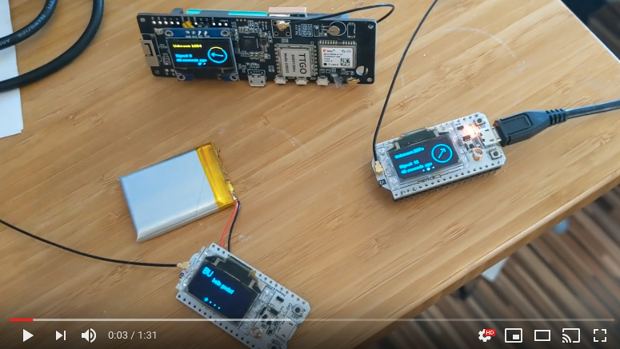

# What is Meshtastic?

Meshtastic™ is a project that lets you use
inexpensive (\$30 ish) GPS radios as an extensible, long battery life, secure, mesh GPS communicator. These radios are great for hiking, skiing, paragliding - essentially any hobby where you don't have reliable internet access. Each member of your private mesh can always see the location and distance of all other members and any text messages sent to your group chat.

The radios automatically create a mesh to forward packets as needed, so everyone in the group can receive messages from even the furthest member. The radios will optionally work with your phone, but no phone is required.

Note: Questions after reading this? See our new [forum](https://meshtastic.discourse.group/).

### Uses

- Outdoor sports where cellular coverage is limited. (Hiking, Skiing, Boating, Paragliding, Gliders etc..)
- Applications where closed source GPS communicators just won't cut it (it is easy to add features for glider pilots etc...)
- Secure long-range communication within groups without depending on cellular providers
- Finding your lost kids ;-)
- Through our [python API](https://pypi.org/project/meshtastic/) use these inexpensive radios to easily add mesh networking to your own projects.

### Features

Not all of these features are fully implemented yet - see **important** disclaimers below. But they should be in by the time we decide to call this project beta (three months?)

- Very long battery life (should be about eight days with the beta software)
- Built in GPS and [LoRa](https://en.wikipedia.org/wiki/LoRa) radio, but we manage the radio automatically for you
- Long range - a few miles per node but each node will forward packets as needed
- Secure - channels are encrypted by AES256 (But see important disclaimers below wrt this feature)
- Shows direction and distance to all members of your channel
- Directed or broadcast text messages for channel members
- Open and extensible codebase supporting multiple hardware vendors - no lock in to one vendor
- Communication API for bluetooth devices (such as our Android app) to use the mesh. An iOS application is in the works. And [Meshtastic-python](https://pypi.org/project/meshtastic/) provides access from desktop computers.
- Very easy sharing of private secured channels. Just share a special link or QR code with friends and they can join your encrypted mesh

This project is currently in beta testing but it is fairly stable and feature complete - if you have questions please [join our discussion forum](https://meshtastic.discourse.group/).

This software is 100% open source and developed by a group of hobbyist experimenters. No warranty is provided, if you'd like to improve it - we'd love your help. Please post in the [forum](https://meshtastic.discourse.group/).

### Beginner's Guide

For an detailed walk-through aimed at beginners, we recommend [meshtastic.letstalkthis.com](https://meshtastic.letstalkthis.com/).

# Updates

Note: Updates are happening almost daily, only major updates are listed below. For more details see our forum.

- 06/24/2020 - 0.7.x Now with over 1000 android users, over 600 people using the radios and translated into 13 languages. Fairly stable and we are working through bugs to get to 1.0.
- 06/04/2020 - 0.6.7 Beta releases of both the application and the device code are released. Features are fairly solid now with a sizable number of users.
- 04/28/2020 - 0.6.0 [Python API](https://pypi.org/project/meshtastic/) released. Makes it easy to use meshtastic devices as "zero config / just works" mesh transport adapters for other projects.
- 04/20/2020 - 0.4.3 Pretty solid now both for the android app and the device code. Many people have donated translations and code. Probably going to call it a beta soon.
- 03/03/2020 - 0.0.9 of the Android app and device code is released. Still an alpha but fairly functional.
- 02/25/2020 - 0.0.4 of the Android app is released. This is a very early alpha, see below to join the alpha-testers group.
- 02/23/2020 - 0.0.4 release. Still very bleeding edge but much closer to the final power management, a charged T-BEAM should run for many days with this load. If you'd like to try it, we'd love your feedback. Click [here](https://github.com/meshtastic/Meshtastic-esp32/blob/master/README.md) for instructions.
- 02/20/2020 - Our first alpha release (0.0.3) of the radio software is ready brave early people.

## Meshtastic Android app

Our Android application is available here:

The link above will return older more stable releases. We would prefer if you join our alpha-test group, because the application is rapidly improving. Three steps to opt-in to the alpha- test:

1. Join [this Google group](https://groups.google.com/forum/#!forum/meshtastic-alpha-testers) with the account you use in Google Play.
2. Go to this [URL](https://play.google.com/apps/testing/com.geeksville.mesh) to opt-in to the alpha test.
3. If you encounter any problems or have questions, post in our [forum](https://meshtastic.discourse.group/) and we'll help.

If you'd like to help with development, the source code is [on github](https://github.com/meshtastic/Meshtastic-Android).

The app is also distributed for Amazon Fire devices via the Amazon appstore: 

## Supported hardware

We currently support two brands of radios. The [TTGO T-Beam](https://www.aliexpress.com/item/4001178678568.html) and the [Heltec LoRa 32](https://heltec.org/project/wifi-lora-32/). Most people should buy the T-Beam and a 18650 battery (total cost less than \$35). Also, the version of the T-Beam we link to is shipped with Meshtastic **preinstalled** by TTGO, so you don't have to install it yourself.

Make sure to buy the frequency range which is legal for your country. For the USA, you should buy the 915MHz version. Getting a version that include a screen is optional, but highly recommended.

Instructions for installing prebuilt firmware can be found [here](https://github.com/meshtastic/Meshtastic-esp32/blob/master/README.md).

For a nice printable cases:

1. TTGO T-Beam V0 see this [design](https://www.thingiverse.com/thing:3773717) by [bsiege](https://www.thingiverse.com/bsiege).
2. TTGO T_Beam V1 see this [design](https://www.thingiverse.com/thing:3830711) by [rwanrooy](https://www.thingiverse.com/rwanrooy) or this [remix](https://www.thingiverse.com/thing:3949330) by [8ung](https://www.thingiverse.com/8ung)
3. Heltec Lora32 see this [design](https://www.thingiverse.com/thing:3125854) by [ornotermes](https://www.thingiverse.com/ornotermes).

# IMPORTANT DISCLAIMERS AND FAQ

For a listing of currently missing features and a FAQ click [here](faq.md).
