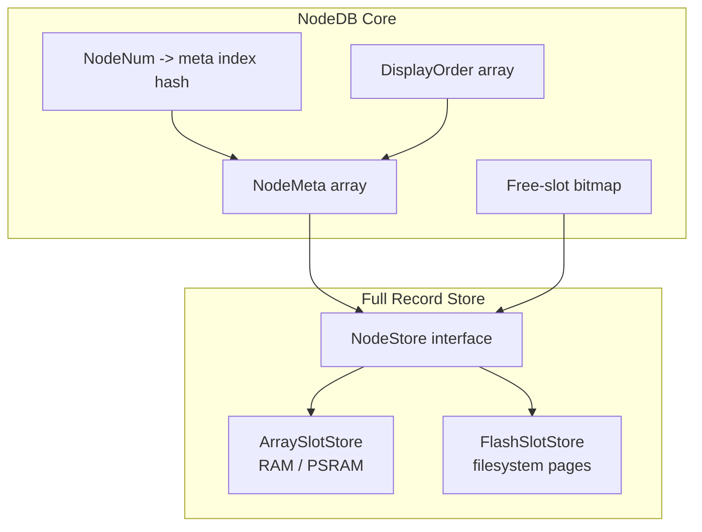
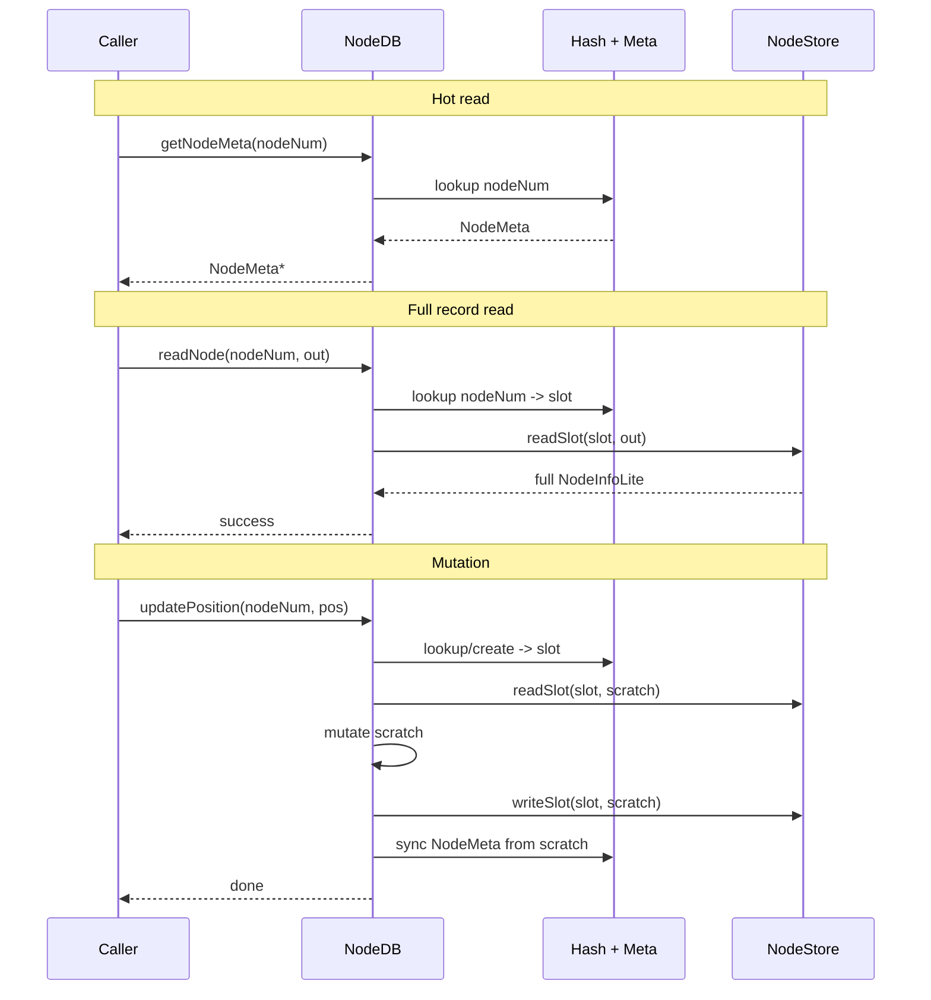

# Stable-Slot NodeDB: One Logical Model, Multiple Storage Backends

## Merge Request Description

### Title

refactor(nodedb): stable-slot NodeDB with streamed persistence and backend-specific storage

### Body

## Summary

- Replaces the current "storage order is display order" `std::vector<meshtastic_NodeInfoLite>` model with stable slots, a lookup index, and a separate display-order view
- Keeps compact hot metadata in DRAM for routing, sorting, and fast lookup
- Adds two runtime storage backends:
  - `ArraySlotStore` for RAM/PSRAM-backed full records
  - `FlashSlotStore` for filesystem-backed full records
- Removes full-DB DRAM staging during save/load
- Preserves one NodeDB behavior across `nRF52`, `ESP32-S3` without PSRAM, and higher-capacity PSRAM hardware
- Targets up to 3000 nodes on hardware that can actually fit it

## Why This Version

The previous plan solved the memory problem, but it introduced too many moving parts at once:

- packed hot index
- separate cuckoo hash
- write-coalesce buffer
- paged cold storage
- scratch-pointer lifetime issues
- broad caller migration after the storage rewrite

This rewrite keeps the same goal, but cuts the design down to the minimum useful pieces:

- stable slot identity
- one lookup structure
- one display-order structure
- one storage backend selected per platform

That keeps the NodeDB contract coherent while still allowing large node counts where the hardware can support them.

## Design Goals

- One logical NodeDB model across all platforms
- Stable slot identity for the lifetime of a node entry
- Separate storage order from display order
- No long-lived mutable pointers escaping NodeDB
- No full repeated-node `std::vector` staging during persistence
- Backend selected by capability and headroom, not scattered `#ifdef` behavior
- 3000-node support for capable hardware without forcing that cap onto smaller targets

## Non-Goals For This MR

- No general-purpose write-coalesce buffer in the first pass
- No broad PSRAM moves for unrelated systems like `PacketHistory`, packet pools, or phone queues
- No attempt to optimize every caller before the new storage model is correct
- No assumption that every board should have the same node cap

## Core Architecture



### 1. Stable Slots

Each node gets a stable slot number. The slot is the identity of the full `meshtastic_NodeInfoLite` record inside the active backend.

Important consequences:

- sorting no longer moves full records
- eviction no longer compacts large arrays
- callers can store `NodeNum` or slot/index handles without silently referring to a different logical node after sort
- `sortingIsPaused` can eventually disappear

### 2. Compact Hot Metadata

Each live node also has a compact DRAM-side metadata entry used for:

- fast lookup by node number
- router hot-path access
- sort keys
- flags that are frequently queried

Planned shape:

```cpp
struct NodeMeta {
    uint32_t node_num;
    uint32_t last_heard;
    uint16_t slot;
    int8_t   snr_q4;
    uint8_t  channel;
    uint8_t  hops_away;   // 0xFF = unknown
    uint8_t  next_hop;
    uint16_t flags;
    uint8_t  role;
    uint8_t  hw_model;
};
```

Target size is roughly 20 bytes per node. Exact packing can be finalized in implementation, but the design does not depend on a highly specialized bit-packed layout.

### 3. Lookup Hash

Use a simple open-addressing hash table for `NodeNum -> meta index`.

Why not cuckoo hashing in the first pass:

- linear probing or robin-hood probing is simpler to implement and debug
- the table is private to NodeDB
- if profiling later shows it is insufficient, it can be swapped without changing the storage contract

### 4. Display Order Is Separate

Keep a `displayOrder[]` array of meta indices.

This array is the only thing that gets sorted for:

- own node first
- favorites first
- `last_heard` descending

UI, phone export, and node-list rendering should iterate the display-order view, not storage order.

### 5. Storage Backends

The full `meshtastic_NodeInfoLite` record lives in exactly one backend at runtime.

#### `ArraySlotStore`

Used on:

- `ESP32-S3` with usable PSRAM
- `native`
- `Portduino`
- optionally other boards where capacity is small enough and RAM is sufficient

Properties:

- full records stored in an array of slots
- internal RAM or PSRAM backing depending platform
- persistence remains `nodes.proto`, but save/load becomes streaming instead of full-vector staging

#### `FlashSlotStore`

Used on:

- `nRF52`
- `ESP32`
- `ESP32-S3` without PSRAM

Properties:

- full records stored in fixed-size slot records on the filesystem
- one slot number maps directly to one record position
- no write buffer in the first pass
- reads use a scratch record
- writes are direct write-through at first; batching can be added later only if measured necessary

## Backend Selection

The backend should be chosen centrally, not ad hoc.

Recommended compile-time / runtime policy:

- `NODEDB_TARGET_CAP`: compile-time upper bound for the build
- `nodeDbRuntimeCap`: actual cap selected at boot
- `NodeStoreKind`: `ARRAY_STORE` or `FLASH_STORE`

Selection rules:

- prefer `ArraySlotStore` when usable PSRAM is present and enough headroom remains after display and packet allocations
- fall back to `FlashSlotStore` when the platform lacks PSRAM or PSRAM headroom is insufficient
- never crash just because a target is `ESP32-S3`; runtime headroom must still be checked

## Capacity Targets

These are planning targets, not unconditional promises.

| Platform Class         | Preferred Backend | Planned Cap | Stretch Goal | Notes                                                    |
| ---------------------- | ----------------- | ----------: | -----------: | -------------------------------------------------------- |
| ESP32-S3 + PSRAM       | `ArraySlotStore`  |        1000 |         3000 | runtime cap based on actual free PSRAM and safety margin |
| ESP32-S3 without PSRAM | `FlashSlotStore`  |         500 |         1000 | depends on flash budget and write-latency testing        |
| ESP32 without PSRAM    | `FlashSlotStore`  |         500 |         1000 | same as above                                            |
| nRF52                  | `FlashSlotStore`  |         300 |          300 | keep first target conservative on 243KB-RAM boards       |
| native / Portduino     | `ArraySlotStore`  |        3000 |        >3000 | mostly for testing and profiling                         |

Important rule: `3000` is a hardware-capability goal, not the universal default.

## Persistence Strategy

### `ArraySlotStore`: Streamed `nodes.proto`

Keep the existing protobuf format for compatibility, but stop building a giant repeated-node vector in RAM.

Instead:

- encode node records directly from live slots using nanopb callbacks
- decode node records one at a time into slots using a small scratch record
- validate each node before inserting it into the live index
- never keep a second full copy of the DB in DRAM

This is the critical crash fix for PSRAM-backed and larger in-memory stores.

### `FlashSlotStore`: Fixed-Size Slot Records

Use a simple page-file layout with explicit record headers.

Recommended record shape:

```cpp
struct FlashNodeRecordHeader {
    uint16_t magic;
    uint8_t  version;
    uint8_t  flags;
    uint16_t encoded_len;
    uint16_t reserved;
    uint32_t crc32;
};

struct FlashNodeRecord {
    FlashNodeRecordHeader hdr;
    uint8_t payload[meshtastic_NodeInfoLite_size];
};
```

Key points:

- payload is protobuf-encoded `NodeInfoLite`, not raw struct bytes
- `encoded_len` is required because nanopb encoding is variable-length
- `crc32` is computed over the valid encoded bytes only
- a manifest file stores store version, capacity, and page geometry

This is still simple enough to reason about, but robust across compilers and architectures.

### Migration Rules

At boot:

1. Choose the active backend and runtime cap.
2. If the active backend already has valid state, load it.
3. Else if the other backend's state exists, import from it.
4. Else if legacy `/prefs/nodes.proto` exists, import from it.
5. Only delete the source format after the destination has been fully written and verified.

This allows:

- legacy firmware upgrade
- switching between PSRAM and non-PSRAM builds
- future backend changes without bricking saved node data

## API Direction

The current `getMeshNode()` / `getMeshNodeByIndex()` pointer API is the main source of risk. The rewrite should move NodeDB toward:

- `const NodeMeta *getNodeMeta(NodeNum n)`
- `bool readNode(NodeNum n, meshtastic_NodeInfoLite &out)`
- `bool readNodeByDisplayIndex(size_t idx, meshtastic_NodeInfoLite &out)`
- explicit mutators for all durable writes

Examples of mutators:

- `setFavorite(NodeNum, bool)`
- `setIgnored(NodeNum, bool)`
- `setMuted(NodeNum, bool)`
- `setKeyVerified(NodeNum, bool)`
- `touchLocalNodeTime(...)`
- existing `updatePosition()`, `updateTelemetry()`, `updateUser()` kept as the main write paths

Temporary compatibility shims can exist during migration, but the final design should not depend on long-lived mutable pointers.

## Locking Model

Add one `concurrency::Lock` to NodeDB.

Rules:

- NodeDB mutators take the lock
- lookup of hot metadata takes the lock briefly
- do not hold the lock across long scans, phone exports, or filesystem writes if a smaller snapshot will do
- `PhoneAPI` queue locks remain local to `PhoneAPI`; they are not a substitute for a NodeDB lock

## Read / Write Flow



## Memory Budget

Approximate DRAM metadata cost for the common model:

- `NodeMeta`: ~20 bytes/node
- `displayOrder`: 2 bytes/node if storing meta index
- hash table: ~2 bytes/node at modest load factor
- free-slot bitmap: negligible

Approximate metadata totals:

- 500 nodes: ~12KB to ~14KB
- 1000 nodes: ~24KB to ~28KB
- 3000 nodes: ~72KB to ~84KB

That is why:

- 3000 nodes belongs on PSRAM-capable hardware
- flash-backed boards still need careful caps even though full records are not in RAM

## Implementation Phases

### Review Rules

- Every phase should compile and be shippable on its own.
- Target diff size per phase: `100-200` changed lines.
- If a phase grows past `200` lines, split it before review.
- Each phase should tell one story only:
  - coupling cleanup
  - API hardening
  - view/index change
  - persistence change
  - backend change
- Do not combine caller migration and backend migration in the same diff.

### Phase 0: Decouple `MAX_NUM_NODES` From Unrelated RAM Users

**Target diff size:** `80-140` lines

**Goal:** Make it safe to raise NodeDB caps without accidentally scaling unrelated memory users.

**Files:**

- `src/graphics/Screen.cpp`
- `src/mesh/PacketHistory.cpp`
- `src/graphics/niche/InkHUD/Applets/User/Heard/HeardApplet.cpp`

**Work:**

- replace `MAX_NUM_NODES`-scaled frame allocation with a screen-specific cap
- replace `PACKETHISTORY_MAX = MAX_NUM_NODES * 2` with an independent constant
- stop using `MAX_NUM_NODES` as a "DB full" proxy in UI code

**Standalone review value:** No NodeDB redesign yet, just removes hidden coupling that would make later cap changes misleading.

**Verification:**

- build `native`, `tbeam-s3-core`, `rak4631`

### Phase 1: Add Explicit Favorite / Ignore / Mute Mutators

**Target diff size:** `120-180` lines

**Goal:** Stop direct external writes to durable node flags.

**Files:**

- `src/mesh/NodeDB.h`
- `src/mesh/NodeDB.cpp`
- `src/modules/AdminModule.cpp`
- `src/graphics/draw/MenuHandler.cpp`

**Work:**

- add `setFavorite(NodeNum, bool)`
- add `setIgnored(NodeNum, bool)`
- add `setMuted(NodeNum, bool)`
- switch admin and menu paths to call mutators instead of writing through `NodeInfoLite *`

**Standalone review value:** Improves correctness today, even before the storage rewrite.

**Verification:**

- build all targets
- manual favorite / ignore / mute smoke test if hardware is available

### Phase 2: Add Key-Verification And Local-Node Mutators

**Target diff size:** `120-180` lines

**Goal:** Remove the remaining direct writers that would break once full records stop living in one stable RAM vector.

**Files:**

- `src/mesh/NodeDB.h`
- `src/mesh/NodeDB.cpp`
- `src/modules/KeyVerificationModule.cpp`
- `src/mesh/MeshService.cpp`

**Work:**

- add `setKeyVerified(NodeNum, bool)`
- add a local-node helper for updating `last_heard` / local time safely
- remove direct writes through raw pointers in key-verification and local refresh paths

**Standalone review value:** Continues the API hardening without changing storage yet.

**Verification:**

- build all targets
- verify key verification and local node refresh still behave correctly

### Phase 3: Replace Long-Lived Pointer Caches With `NodeNum`

**Target diff size:** `120-180` lines

**Goal:** Stop callers from retaining `NodeInfoLite *` across frames or sessions.

**Files:**

- `src/graphics/draw/UIRenderer.h`
- `src/graphics/draw/UIRenderer.cpp`
- `src/modules/CannedMessageModule.h`
- `src/modules/CannedMessageModule.cpp`
- `src/graphics/niche/InkHUD/Applets/User/Heard/HeardApplet.cpp`

**Work:**

- change cached UI lists from `NodeInfoLite *` to `NodeNum`
- do fresh lookup on use
- keep behavior the same from the user's perspective

**Standalone review value:** Fixes a real correctness issue in the current design and clears the path for scratch-buffer reads later.

**Verification:**

- build all targets
- verify favorite-node UI and canned-message destination selection still work

### Phase 4: Add `displayOrder[]` Without Changing Storage

**Target diff size:** `140-200` lines

**Goal:** Introduce a separate presentation view while still using `meshNodes` as the backing store.

**Files:**

- `src/mesh/NodeDB.h`
- `src/mesh/NodeDB.cpp`

**Work:**

- add `displayOrder[]`
- initialize it to current storage order
- make `getMeshNodeByIndex()` read through `displayOrder[]`
- make `readNextMeshNode()` iterate display order, not raw storage order

**Standalone review value:** Behavior should remain the same, but the presentation path becomes independent from storage layout.

**Verification:**

- build all targets
- verify node list and phone export still enumerate nodes correctly

### Phase 5: Stop Physically Sorting Storage

**Target diff size:** `100-160` lines

**Goal:** Make sorting reorder only the display view.

**Files:**

- `src/mesh/NodeDB.cpp`

**Work:**

- change `sortMeshDB()` to sort `displayOrder[]`
- stop moving full records during sort
- keep existing sort semantics: own node first, favorites first, `last_heard` descending

**Standalone review value:** Removes one of the most dangerous current behaviors without introducing any backend work.

**Verification:**

- build all targets
- verify sort order remains unchanged to the user

### Phase 6: Add `NodeMeta[]` Shadow Cache

**Target diff size:** `140-200` lines

**Goal:** Introduce compact DRAM metadata while still treating the vector-backed store as the source of truth.

**Files:**

- `src/mesh/NodeDB.h`
- `src/mesh/NodeDB.cpp`

**Work:**

- add `NodeMeta[]`
- add helpers to rebuild and refresh metadata from the current store
- begin routing hot metadata reads through `NodeMeta`

**Standalone review value:** Makes the hot/cold split visible without switching storage backends yet.

**Verification:**

- build all targets
- verify metadata-dependent operations match the full record contents

### Phase 7: Add `NodeNum -> meta index` Hash Lookup

**Target diff size:** `120-180` lines

**Goal:** Replace linear node lookup with a simple private hash table.

**Files:**

- `src/mesh/NodeDB.h`
- `src/mesh/NodeDB.cpp`

**Work:**

- add open-addressing hash table
- rebuild it from `NodeMeta[]`
- switch `getMeshNode()` and hot metadata lookups to use the hash first

**Standalone review value:** Performance improvement with no backend swap yet, so the change is easy to isolate in review.

**Verification:**

- build all targets
- add lookup / insert / remove tests if possible in native

### Phase 8: Stream The `nodes.proto` Save Path

**Target diff size:** `140-200` lines

**Goal:** Eliminate full-DB DRAM staging during save while keeping the current on-disk protobuf format.

**Files:**

- `src/mesh/NodeDB.cpp`

**Work:**

- encode node records directly from live storage with a streamed nanopb writer
- save only the live `[0, numMeshNodes)` range instead of the padded backing vector
- stop rebuilding or serializing a giant repeated-node vector only to save it

**Standalone review value:** Real memory win on its own, before any backend work lands.

**Verification:**

- build all targets
- save NodeDB and confirm no permanent heap drop afterward

### Phase 9: Stream The `nodes.proto` Load Path

**Target diff size:** `140-200` lines

**Goal:** Eliminate full-DB DRAM staging during load.

**Files:**

- `src/mesh/NodeDB.cpp`

**Work:**

- decode one node at a time into existing storage
- validate records before admitting them
- release temporary vector capacity explicitly after legacy load if any remains

**Standalone review value:** Completes the streamed protobuf path without changing user-visible storage yet.

**Verification:**

- build all targets
- load a saved DB and confirm no permanent heap pin remains

### Phase 10: Introduce `NodeStore` With A Shim Backed By Current Storage

**Target diff size:** `140-200` lines

**Goal:** Add the backend abstraction without changing runtime behavior.

**Files:**

- `src/mesh/NodeStore.h`
- `src/mesh/ArraySlotStore.h`
- `src/mesh/ArraySlotStore.cpp`
- `src/mesh/NodeDB.h`
- `src/mesh/NodeDB.cpp`

**Work:**

- define the `NodeStore` interface
- add an in-memory `ArraySlotStore` shim backed by the current storage model
- switch NodeDB to call the store interface

**Standalone review value:** Pure refactor. Backend interface exists, behavior should not change.

**Verification:**

- build all targets
- verify save/load and normal lookups still work

### Phase 11: Enable PSRAM-Backed `ArraySlotStore`

**Target diff size:** `140-200` lines

**Goal:** Make the array backend work for high-capacity `ESP32-S3` hardware.

**Files:**

- `src/mesh/ArraySlotStore.h`
- `src/mesh/ArraySlotStore.cpp`
- `src/mesh/NodeDB.cpp`
- `src/mesh/mesh-pb-constants.h`

**Work:**

- add internal RAM / PSRAM allocation paths
- add runtime headroom checks
- compute runtime cap conservatively

**Standalone review value:** High-capacity hardware starts benefiting immediately, while non-PSRAM builds remain unchanged.

**Verification:**

- `pio run -e tbeam-s3-core`
- instrument free heap / PSRAM before and after save/load

### Phase 12: Add `FlashSlotStore` Raw Record I/O

**Target diff size:** `140-200` lines

**Goal:** Land the on-disk slot format and the low-level flash helper without wiring it into NodeDB yet.

**Files:**

- `src/mesh/FlashSlotStore.h`
- `src/mesh/FlashSlotStore.cpp`

**Work:**

- define manifest format
- define fixed-size slot record header
- add raw `readSlot()` / `writeSlot()` helpers with CRC and `encoded_len`

**Standalone review value:** Easy to review as a self-contained storage helper with no higher-level behavior change.

**Verification:**

- build `rak4631`
- native or host-side helper tests if practical

### Phase 13: Integrate `FlashSlotStore` For Boot Scan And Reads

**Target diff size:** `140-200` lines

**Goal:** Make flash-backed full-record reads real on `nRF52` and no-PSRAM boards.

**Files:**

- `src/mesh/NodeDB.h`
- `src/mesh/NodeDB.cpp`
- `src/mesh/FlashSlotStore.cpp`

**Work:**

- choose `FlashSlotStore` on `nRF52` and no-PSRAM ESP32 / ESP32-S3
- rebuild `NodeMeta[]` and the hash from the flash store at boot
- make full-record reads go through flash slots

**Standalone review value:** Read path is live, but writes can still follow the old persistence path until the next phase.

**Verification:**

- build `rak4631`
- verify boot, read, and phone export from flash-backed storage

### Phase 14: Integrate `FlashSlotStore` Writes And Migration

**Target diff size:** `150-200` lines

**Goal:** Complete the flash-backed backend for production use.

**Files:**

- `src/mesh/NodeDB.cpp`
- `src/mesh/FlashSlotStore.cpp`

**Work:**

- write mutations through the flash store
- migrate legacy `/prefs/nodes.proto` into flash slots
- only delete the source after destination verification

**Standalone review value:** This is the smallest reviewable diff that makes the flash backend fully usable.

**Verification:**

- build `rak4631`
- migration, reboot, and mutation persistence tests

### Phase 15: Capacity Enablement And Final Cap Updates

**Target diff size:** `100-160` lines

**Goal:** Raise caps only after the storage model is stable.

**Files:**

- `src/mesh/mesh-pb-constants.h`
- any platform-specific capability logic

**Work:**

- add `NODEDB_TARGET_CAP`
- set final initial targets:
  - `ESP32-S3 + PSRAM`: `3000`
  - `ESP32-S3 without PSRAM`: `500`
  - `ESP32`: `500`
  - `nRF52`: `300`

**Standalone review value:** Final cap change is isolated from all architectural churn.

**Verification:**

- build matrix
- synthetic population tests
- memory telemetry

### Phase 16: Optional Follow-Ups

Only after the above is stable:

- small dirty-slot cache for the flash backend
- more aggressive `NodeMeta` packing
- hash-table tuning
- unrelated PSRAM work in other subsystems

Note: phases 17 and 18 were later split out as flash-write follow-ups and are tracked in `docs/tiered-nodedb-memory.md`. Phase numbering below preserves that history.

### Phase 19: Telemetry / Display Node Counts

**Target diff size:** `80-140` lines

**Goal:** Make the total NodeDB size visible from the device display and align active-node displays with the same online/total model already exposed in telemetry.

**Files:**

- `src/graphics/draw/UIRenderer.cpp`
- `src/graphics/niche/InkHUD/Applets/User/RecentsList/RecentsListApplet.cpp`
- any other display surface discovered during the audit that currently shows only an active-node count

**Work:**

- audit node-count displays and identify which ones are showing an active subset rather than the full NodeDB size
- treat `<active>/<total>` as the required format for active-node displays
- source the denominator from live NodeDB totals, not from `MAX_NUM_NODES`, runtime caps, or storage capacity
- keep the denominator consistent with the numerator's scope; if the active count excludes the local node, exclude the local node from the total too
- leave total-only views clearly labeled as totals instead of presenting them as active counts
- keep telemetry field semantics unchanged; this phase aligns display wording with the existing `num_online_nodes` / `num_total_nodes` model

**Standalone review value:** Makes high-capacity NodeDB behavior visible from the device itself, which reduces ambiguity during cap and backend validation.

**Verification:**

- build `tbeam-s3-core`
- build `heltec-v3`
- build `rak4631`
- manually populate a DB where active nodes are a strict subset of total nodes and confirm active-node displays render `<active>/<total>`
- verify remote-only displays use a matching denominator

## Test Plan

- [ ] Build `native`
- [ ] Build `tbeam-s3-core`
- [ ] Build `rak4631`
- [ ] Verify legacy `nodes.proto` import into `ArraySlotStore`
- [ ] Verify legacy `nodes.proto` import into `FlashSlotStore`
- [ ] Verify backend-to-backend migration when the active backend changes
- [ ] Verify no full-DB DRAM staging during streamed save/load
- [ ] Populate 3000 synthetic nodes on PSRAM hardware and confirm bounded memory usage
- [ ] Populate 300 synthetic nodes on `nRF52` and confirm bounded memory usage
- [ ] Populate 500 synthetic nodes on no-PSRAM ESP32 / ESP32-S3 builds and confirm bounded memory usage
- [ ] Verify favorites-first and `last_heard` display ordering
- [ ] Verify router hot paths use metadata only
- [ ] Verify phone app node export still completes correctly
- [ ] Verify active-node displays show `<active>/<total>` with correct local-node inclusion
- [ ] Verify node deletion and eviction do not compact unrelated slots
- [ ] Verify corrupted flash slot records are skipped cleanly
- [ ] Verify power-loss recovery behavior on flash-backed builds

## Expected Outcome

After this plan lands:

- NodeDB has one coherent storage model across platforms
- large-capacity hardware can scale to 3000 nodes
- `nRF52` remains supported through a simpler flash-backed store with a 300-node target
- `ESP32-S3` without PSRAM remains supported through the same flash-backed model
- routing and sorting use compact metadata in DRAM
- persistence no longer depends on materializing the full DB in internal heap
- active-node displays make the current active/total DB size visible without inferring it from screen fullness
- the design is simple enough to debug before adding any optional caching layer
