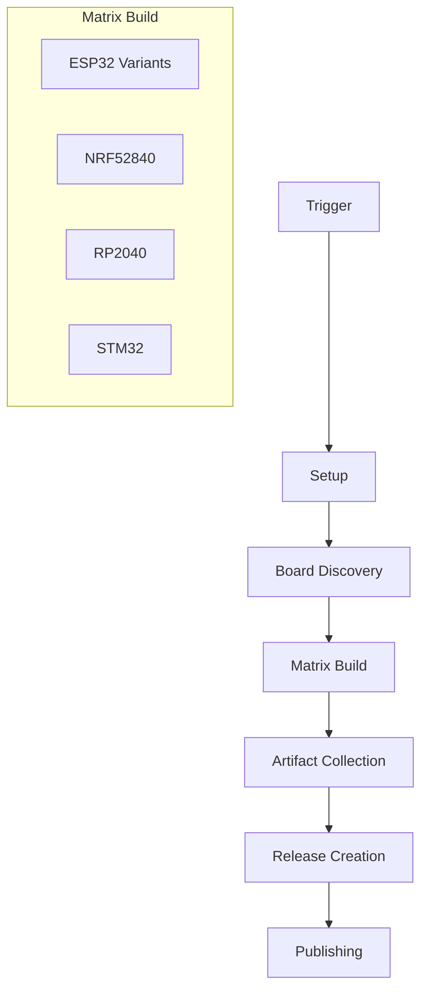

# Meshtastic Firmware Build Workflow Plan

## Overview

This document outlines the plan for an improved GitHub Actions workflow to build all Meshtastic boards.

## Current Structure Analysis

The current workflow system:
- Uses a matrix strategy for parallel builds
- Has separate workflows for different architectures (ESP32, NRF52, etc.)
- Includes comprehensive artifact handling
- Uses Python script for board discovery

## Proposed Improvements

### 1. Workflow Organization



### 2. Key Enhancements

1. **Build Optimization**
   - Implement build caching for PlatformIO dependencies
   - Add parallel job execution for faster builds
   - Optimize artifact handling

2. **Quality Assurance**
   - Add build status checks
   - Implement firmware size monitoring
   - Add memory usage tracking

3. **Release Management**
   - Automated changelog generation
   - Version tagging
   - Release artifact organization

4. **Documentation**
   - Automated build status documentation
   - Board compatibility matrix generation
   - Clear installation instructions per board

### 3. Implementation Steps

1. Create main workflow file (`firmware_build.yml`)
   - Define triggers (push, PR, manual)
   - Set up concurrency handling
   - Configure build matrix

2. Implement build caching
   - Cache PlatformIO packages
   - Cache build artifacts
   - Optimize rebuild times

3. Enhance artifact handling
   - Organize by architecture
   - Include debug symbols
   - Add firmware checksums

4. Add quality checks
   - Code size comparison
   - Memory usage analysis
   - Build time tracking

5. Improve release process
   - Automated release notes
   - Artifact organization
   - Version management

## Next Steps

1. Review this plan with team members
2. Switch to Code mode to implement the workflow file
3. Test the new workflow in a development branch
4. Monitor build times and optimize as needed

## Technical Details

### Build Matrix Configuration

```yaml
matrix:
  arch:
    - esp32
    - esp32s3
    - esp32c3
    - esp32c6
    - nrf52840
    - rp2040
    - stm32
```

### Cache Configuration

```yaml
cache:
  paths:
    - .pio
    - ~/.platformio
    - ~/.cache/pip
```

### Workflow Structure

1. **Setup Phase**
   - Environment configuration
   - Cache restoration
   - Board discovery

2. **Build Phase**
   - Matrix build execution
   - Parallel job handling
   - Status monitoring

3. **Post-Build Phase**
   - Artifact collection
   - Quality checks
   - Release preparation

4. **Release Phase**
   - Version tagging
   - Documentation updates
   - Artifact publishing