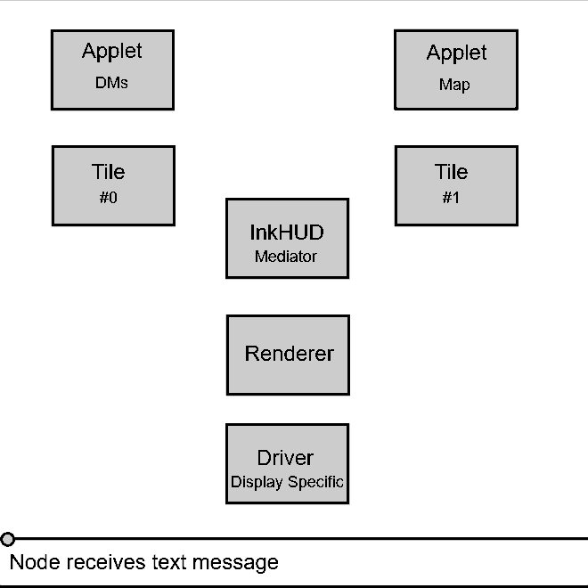
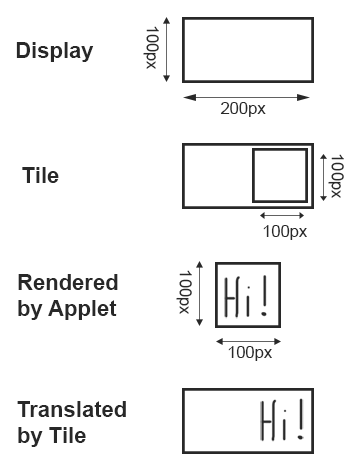
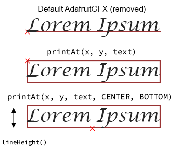

# InkHUD

This document is intended as a reference for maintainers. A haphazard collection of notes which _might_ be helpful.


---

- [Purpose](#purpose)
- [Design Principles](#design-principles)
  - [Self-Contained](#self-contained)
  - [Static](#static)
  - [Non-interactive](#non-interactive)
  - [Customizable](#customizable)
  - [Event-Driven Rendering](#event-driven-rendering)
  - [No `#ifdef` spaghetti](#no-ifdef-spaghetti)
- [The Implementation](#the-implementation)
- [The Rendering Process](#the-rendering-process)
- [Concepts](#concepts)
  - [NicheGraphics Framework](#nichegraphics-framework)
  - [NicheGraphics E-Ink Drivers](#nichegraphics-e-ink-drivers)
  - [InkHUD Applets](#inkhud-applets)
- [Adding a Variant](#adding-a-variant)
  - [platformio.ini](#platformioini)
  - [nicheGraphics.h](#nichegraphicsh)
- [Class Notes](#class-notes)
  - [`InkHUD::InkHUD`](#inkhudinkhud)
  - [`InkHUD::Persistence`](#inkhudpersistence)
  - [`InkHUD::Persistence::Settings`](#inkhudpersistencesettings)
  - [`InkHUD::Persistence::LatestMessage`](#inkhudpersistencelatestmessage)
  - [`InkHUD::WindowManager`](#inkhudwindowmanager)
  - [`InkHUD::Renderer`](#inkhudrenderer)
  - [`InkHUD::Renderer::DisplayHealth`](#inkhudrendererdisplayhealth)
  - [`InkHUD::Events`](#inkhudevents)
  - [`InkHUD::Applet`](#inkhudapplet)
  - [`InkHUD::SystemApplet`](#inkhudsystemapplet)
  - [`InkHUD::Tile`](#inkhudtile)
  - [`InkHUD::AppletFont`](#inkhudappletfont)

## Purpose

InkHUD is a minimal UI for E-Ink devices. It displays the user's choice of info, as statically as possible, to minimize the amount of display refreshing.

It is intended to supplement a connected client app.

## Design Principles

### Self-Contained

- Keep InkHUD code within `/src/graphics/niche/InkHUD`.
- Place reusable components within `/src/graphics/niche`, for other UIs to take advantage of.
- Interact with the firmware code using the **Module API**, **Observables**, and other similarly non-intrusive hooks.

### Static

Information should be displayed as statically as possible. Unnecessary updates should be avoided.

As as example, fixed timestamps are used instead of `X seconds ago` labels, as these need to be constantly updated to remain current.

### Non-interactive

InkHUD aims to be a "heads up display". The intention is for the user to glance at the display. The intention is _not_ for the user to frequently interact with the display.

Some interactivity is tolerated as a means to an end: the display _should_ be customizable, but this should be minimized as much as possible.

_Edit: there's significant demand for keyboard support, so some sort of free-text feature will need to be added eventually, although it does go against the original design principles._

### Customizable

The user should be given the choice to decide which information they would like to receive, and how they would like to receive it.

### Event-Driven Rendering

The display image does not update "automatically". Individual applets are responsible for deciding when they have new information to show, and then requesting a display update.

### No `#ifdef` spaghetti

**Don't** use preprocessor macros for device-specific configuration. This should be achieved with config methods, in [`nicheGraphics.h`](#nichegraphicsh).

**Do** use preprocessor macros to guard all files

- `#ifdef MESHTASTIC_INCLUDE_INKHUD` for InkHUD files
- `#ifdef MESHTASTIC_INCLUDE_NICHE_GRAPHICS` for reusable components (drivers, etc)

## The Implementation

- Variant's platformio.ini file extends `inkhud` (defined in InkHUD/PlatformioConfig.ini)
  - original screen class suppressed: `MESHTASTIC_EXCLUDE_SCREEN`
  - ButtonThread suppressed: `HAS_BUTTON=0`
  - NicheGraphics components included: `MESHTASTIC_INCLUDE_NICHE_GRAPHICS`
  - InkHUD components included: `MESHTASTIC_INCLUDE_INKHUD`
- `main.cpp`
  - includes `nicheGraphics.h` (from variant folder)
  - calls `setupNicheGraphics`, (from nicheGraphics.h)
- `nicheGraphics.h`
  - includes InkHUD components
  - includes shared NicheGraphics components
  - `setupNicheGraphics`
    - configures and connects components
    - `inkhud->begin`

## The Rendering Process

(animated diagram)



An overview:

- A component calls `requestUpdate` (applets only) or `InkHUD::forceUpdate`
- `Renderer` schedules a render cycle for the next loop(), using `Renderer::runOnce`
- `Renderer` determines whether the update request is valid
- `Renderer` asks relevant applets to render
- Applet dimensions are updated (by Applet's `Tile`)
- Applets generate pixel output, and pass this to their `Tile`
- Tiles shift these "relative" pixels to their true region, for multiplexing
- Tiles pass the pixels to `Renderer`
- `Renderer` applies any global display rotation to the pixels
- `Renderer` combines the pixels into the finished image
- The finished image is passed to the display driver, starting the physical update process

## Concepts

### NicheGraphics Framework

InkHUD is implemented as a _NicheGraphics_ UI.

Intended as a pattern / philosophy for implementing self-contained UIs, to suit various niche devices, which are best served by their own custom user interface.

Hypothetical examples: E-Ink, 1602 LCDs, tiny OLEDs, smart watches, etc

A NicheGraphics UI:

- Is self-contained
- Makes use of the loose collection of resources (drivers, input methods, etc) gathered in the `/src/graphics/niche` folder.
- Implements a `setupNicheGraphics()` method.

### NicheGraphics E-Ink Drivers

InkHUD uses a set of custom E-Ink drivers. These are not based on GxEPD2, or any other code base. They are written directly on-top of the Meshtastic firmware, to make use of the OSThread class for asynchronous display updates.

Interacting with the drivers is straightforward. InkHUD generates a frame of 1-bit image data. This image data is passed to the driver, along with the type of refresh to use (FULL or FAST).

`driver->update(uint8_t* buffer, EInk::UpdateTypes::FULL)`

For more information, see the documentation in `src/graphics/niche/Drivers/EInk`

### InkHUD Applets

An InkHUD applet is a class which generates a screen of info for the display.

Consider: `DMApplet.h` (displays most recent direct message) and `RecentsList.h` (displays a list of recently heard nodes)

- Applets are modular: they are easy to write, and easy to implement. Users select which applets they want, using the menu.
- Applets use responsive design. They should scale for different screens / layouts / fonts.
- Applets decide when to update. They use the Module API, Observers, etc, to retrieve information, and request a display update when they have something interesting to show.

See `src/graphics/niche/InkHUD/Applets/Examples` for example code.

#### Writing an Applet

Your new applet class will inherit `InkHUD::Applet`.

```cpp
class BasicExampleApplet : public Applet
{
  public:
    // You must have an onRender() method
    // All drawing happens here

    void onRender() override;
};
```

The `onRender` method is called when the display image is redrawn. This can happen at any time, so be ready!

```cpp
// All drawing happens here
// Our basic example doesn't do anything useful. It just passively prints some text.
void InkHUD::BasicExampleApplet::onRender()
{
    printAt(0, 0, "Hello, world!");
}
```

Your applet will need to scale automatically, to suit a variety of screens / layouts / fonts. Make sure you draw relative to applet's size.

| edge   | coordinate | shorthand |
| ------ | ---------- | --------- |
| left   | 0          | `X(0.0)`  |
| top    | 0          | `Y(0.0)`  |
| right  | `width()`  | `X(1.0)`  |
| bottom | `height()` | `Y(1.0)`  |

The same principles apply for drawing text. Methods like `AppletFont::lineHeight` and `getTextWidth` are useful here.

```cpp
std::string line1 = "Line 1";
printAt(0, Y(0.5), line1);
drawRect(0, Y(0.5), getTextWidth(line1), fontSmall.lineHeight(), BLACK);
```

Your applet will only be redrawn when _something_ requests a display update. Your applet is welcome to request a display update, when it determines that it has new info to display, by calling `requestUpdate`.

Exactly how you determine this, depends on what your applet actually does. Here's a code snippet from one of the example applets. The applet is requesting an update when a new message is received.

```cpp
// We configured the Module API to call this method when we receive a new text message
ProcessMessage InkHUD::NewMsgExampleApplet::handleReceived(const meshtastic_MeshPacket &mp)
{

    // Abort if applet fully deactivated
    // Don't waste time: we wouldn't be rendered anyway
    if (!isActive())
        return ProcessMessage::CONTINUE;

    // Check that this is an incoming message
    // Outgoing messages (sent by us) will also call handleReceived

    if (!isFromUs(&mp)) {
        // Store the sender's nodenum
        // We need to keep this information, so we can re-use it anytime render() is called
        haveMessage = true;
        fromWho = mp.from;

        // Tell InkHUD that we have something new to show on the screen
        requestUpdate();
    }

    // Tell Module API to continue informing other firmware components about this message
    // We're not the only component which is interested in new text messages
    return ProcessMessage::CONTINUE;
}
```

#### Implementing an Applet

Incorporating your new applet into InkHUD is easy.

In a variant's `nicheGraphics.h`:

- `#include` your applet
- `inkhud->addApplet("My Applet", new InkHUD::MyApplet);`

You will need to add these lines to any variants which will use your applet.

#### Applet Bases

If you need to create several similar applets, it might make sense to create a reusable base class. Several of these already exist in `src/graphics/niche/InkHUD/Applets/Bases`, but use these with caution, as they may be modified in future.

#### System Applets

So far, we have been talking about "user applets". We also recognize a separate category of "system applets". These handle things like the menu, and the boot screen. These often need special handling, and need to be implemented manually.

## Adding a Variant

In `/variants/<YOUR_VARIANT>/`:

### platformio.ini

Extend `inkhud`, then combine with any other platformio config your hardware variant requires.

_(Example shows only config required by InkHUD. This is not a complete `env` definition.)_

```ini
[env:YOUR_VARIANT-inkhud]
extends = esp32s3_base, inkhud ; or nrf52840_base, etc

build_src_filter =
${esp32_base.build_src_filter}
${inkhud.build_src_filter}

build_flags =
${esp32s3_base.build_flags}
${inkhud.build_flags}

lib_deps =
${inkhud.lib_deps} ; InkHUD libs first, so we get GFXRoot instead of AdafruitGFX
${esp32s3_base.lib_deps}
```

### nicheGraphics.h

⚠ Wrap this file in `#ifdef MESHTASTIC_INCLUDE_NICHE_GRAPHICS`

`nicheGraphics.h` should be placed in the same folder as your variant's `platformio.ini`. If this is not possible, modify `build_src_filter`.

`nicheGraphics.h` should contain a `setupNicheGraphics` method, which creates and configures the various components for InkHUD.

- Display
  - Start SPI
  - Create display driver
- InkHUD
  - Create InkHUD instance
  - Set E-Ink fast refresh limit (`setDisplayResilience`)
  - Set fonts
  - Set default user-settings
  - Select applets to build (`addApplet`)
  - Start InkHUD
- Buttons
  - Setup `TwoButton` driver (user button, optional "auxiliary" button)
  - Connect to InkHUD handlers (use lambdas)

For well commented examples, see:

- `variants/heltec_vision_master_e290/nicheGraphics.h` (ESP32)
- `variants/t-echo/nicheGraphics.h` (NRF52)

## Class Notes

### `InkHUD::InkHUD`

_`src/graphics/niche/InkHUD/InkHUD.h`_

- singleton
- mediator between other InkHUD components

#### `getInstance()`

Gets access to the class.
First `getInstance` call instantiates the class, and the subclasses:

- `InkHUD::Persistence`
- `InkHUD::WindowManager`
- `InkHUD::Renderer`
- `InkHUD::Events`

For convenience, many InkHUD components call this on `begin`, and store it as `InkHUD* inkhud`.

---

### `InkHUD::Persistence`

_`src/graphics/niche/InkHUD/Persistence.h`_

Stores InkHUD data in flash

- settings
- most recent text message received (both for broadcast and DM)

In rare cases, applets may store their own specific data separately (e.g. `ThreadedMessageApplet`)

Data saved only on shutdown / reboot. Not saved if power is removed unexpectedly.

---

### `InkHUD::Persistence::Settings`

_`src/graphics/niche/InkHUD/Persistence.h`_

Settings which relate to InkHUD. Mostly user's customization, but some values record the UI's state (e.g. `tips.safeShutdownSeen`)

- stored using `FlashData.h` (a shared Niche Graphics tool)
- not encoded as protobufs
- serialized directly as bytes of struct

#### Defaults

Global default values are set when the struct is defined (Persistence.h).
Per-variant defaults are set by modifying the values of the settings instance during `setupNicheGraphics()`, before `inkhud->begin` is called.

```cpp
inkhud->persistence->settings.userTiles.count = 2;
inkhud->persistence->settings.userTiles.maxCount = 4;
inkhud->persistence->settings.rotation = 3;
```

By modifying the values at this point, they will be used if we fail to load previous settings from flash (not yet saved, old version, etc)

---

### `InkHUD::Persistence::LatestMessage`

_`src/graphics/niche/InkHUD/Persistence.h`_

Most recently received text message

- most recent DM
- most recent broadcast

Collected here, so various user applets don't all have to store their own copy of this info.

We are unable to use `devicestate.rx_text_message` for this purpose, because:

- it is cleared by an outgoing text message
- we want to store both a recent broadcast and a recent DM

#### Saving / Loading

_A bit of a hack.._
Stored to flash using `InkHUD::MessageStore`, which is really intended for storing a thread of messages (see `ThreadedMessageApplet`). Used because it stores strings more efficiently than `FlashData.h`.

The hack is:

- If most recent message was a DM, we only store the DM.
- If most recent message was a broadcast, we store both a DM and a broadcast. The DM may be 0-length string.

---

### `InkHUD::WindowManager`

_`src/graphics/niche/InkHUD/WindowManager.h`_

Manages which applets are shown, and their size / position (by manipulating the "tiles")

- owns the `Tile` instances
- creates and destroys tiles; sets size and position:
  - at startup
  - at runtime, when config changes (layout, rotation, etc)
- activates (or deactivates) applets
- cycling through applets (e.g. on button press)

The window manager doesn't process pixels; that is handled by the `InkHUD::Tile` objects.

Note: Some of the methods (incl. `changeLayout`, `changeActivatedApplets`) don't trigger changes themselves. They should be called _after_ the relevant values in `inkhud->persistence->settings` have been modified.

---

### `InkHUD::Renderer`

_`src/graphics/niche/InkHUD/Renderer.h`_

Get pixel output from applets (via a tile), combine, and pass to the driver.

- triggered by `requestUpdate` or `forceUpdate`
- not run immediately: allows multiple applets to share one render cycle
- calls `Applet::onRender` for relevant applets
- applies global rotation
- passes finalized image to driver

`requestUpdate` is for applets (user or system). Renderer will honor the request if the applet is visible. `forceUpdate` can be used anywhere, but not from user applets, please.

#### Asynchronous updates

`requestUpdate` and `forceUpdate` do not block code execution. They schedule rendering for "ASAP", using `Renderer::runOnce`. Renderer then gets pixel output from relevant applets, and hands the assembled image to the driver. Driver's update process is also asynchronous. If the driver is busy when `requestUpdate` or `forceUpdate` is called, another rendering will run as soon as possible. This is handled by `Renderer::runOnce`

#### Blocking updates

If needed, call `forceUpdate` with the optional argument `async=false` to wait while an update runs (> 1 second). Additionally, the `awaitUpdate` method can be used to block until any previous update has completed. An example usage of this is waiting to draw the shutdown screen.

#### Global rotation

The exact size / position / rotation of InkHUD applets is configurable by the user. To achieve this, applets draw pixels between 0,0 and `Applet::width()`, `Applet::height()`

- **Scaling**: Applet's `width()` and `height()` are set by `Tile` before rendering starts
- **Translation**: `Tile` shifts applet pixels up/down/left/right
- **Rotation**: `Renderer` rotates all pixels it receives, before placing them into the final image buffer

---

### `InkHUD::Renderer::DisplayHealth`

_`src/graphics/niche/InkHUD/DisplayHealth.h`_

Responsible for maintaining display health, by optimizing the ratio of FAST vs FULL refreshes

- count number of FAST vs FULL refreshes (debt)
- suggest either FAST or FULL type
- periodically FULL refresh the display unprovoked, if needed

#### Background Info

When the image on an E-Ink display is updated, different procedures can be used to move the pixels to their new states. We have defined two procedures: `FAST` and `FULL`.

A `FAST` update moves pixels directly from their old position, to their new position. This is aesthetically pleasing, and quick, _but_ it is challenging for the display hardware. If used excessively, pixels can build up residual charge, which negatively impacts the display's lifespan and image quality.

A `FULL` update first moves all pixels between black and white, before letting them eventually settle at their final position. This causes an unpleasant flashing of the display image, but is best for the display health and image quality.

Most displays readily tolerate `FAST` updates, so long as a `FULL` update is occasionally performed. How often this `FULL` update is required depends on the display model.

#### Debt

`InkHUD::DisplayHealth` records how many `FAST` refreshes have occurred since the previous `FULL` refresh.

This is referred to as the "full refresh debt".

If an update of a specific type (`FULL` / `FAST`) is requested / forced, this will be granted.

If an update is requested / forced _without_ a specified type (`UpdateTypes::UNSPECIFIED`), `DisplayHealth` will select either `FAST` or `FULL`, in an attempt to maintain a target ratio of fast to full updates.

This target is set by `InkHUD::setDisplayResilience`, when setting up in `nichegraphics.h`

If an _excessive_ amount of `FAST` refreshes are performed back-to-back, `DisplayHealth` will begin artificially inflating the full refresh debt. This will cause the next few `UNSPECIFIED` updates to _all_ be performed as `FULL`, while the debt is paid down.

This system of "full refresh debt" allows us to increase perceived responsiveness by tolerating additional strain on the display during periods of user interaction, and attempting to "repair the damage" later, once user interaction ceases.

#### Maintenance

The system of "full refresh debt" assumes that the display will perform many updates of `UNSPECIFIED` type between periods of user interaction. Depending on the amount of mesh traffic / applet selection, this may not be the case.

If debt is particularly high, and no updates are taking place organically, `DisplayHealth` will begin infrequently performing `FULL` updates, purely to pay down the full refresh debt.

---

### `InkHUD::Events`

Handles events which impact the InkHUD system generally (e.g. shutdown, button press).

Applets themselves do also listen separately for various events, but for the purpose of gathering information which they would like to display.

#### Buttons

Button input is sometimes handled by a system applet. `InkHUD::Events` determines whether the button should be handled by a specific system applet, or should instead trigger a default behavior

#### Factory Reset

The Events class handles the admin messages(s) which trigger factory reset. We set `Events::eraseOnReboot = true`, which causes `Events::onReboot` to erase the contents of InkHUD's data directory. We do this because some applets (e.g. ThreadedMessageApplet) save their own data to flash, so if we erased earlier, that data would get re-written during reboot.

---

### `InkHUD::Applet`

A base class for applets. An applet is one "program", which may show info on the display.

To oversimplify, all of the InkHUD code "under the hood" only exists to support applets. Applets are what actually shows useful information to the user. This base class exposes the functionality needed to write an applet.

#### Drawing Methods

`Applet` implements most AdafruitGFX drawing methods. Exception is the text handling. `printAt`, `printWrapped`, and `printThick` should be used instead. These are intended to be more convenient, but they also implement the character substitution system which powers the foreign alphabet support.

`Applet` also adds methods for drawing several design elements which are re-used commonly though-out InkHUD.

#### InkHUD Events

Applets undergo a number of state changes: activated / deactivated by user, brought to foreground / hidden to background by user button press, etc. The `Applet` class provides a set of virtual methods, which an applet can override to appropriately handle these events.

The `onRender` virtual method is one example. This is called when an applet is rendered, and should execute all drawing code. An applet _must_ implement this method.

#### Responsive Design

An applet's size will vary depending on the screen size, and the user's layout (multiplexing). Immediately before `onRender` is called, an applet's dimensions are updated, so that `width()` and `height()` will give the required size. The applet should draw its graphical elements relative to these values. The methods `X(float)` and `Y(float)` are also provided for convenience.

| edge   | coordinate | shorthand |
| ------ | ---------- | --------- |
| left   | 0          | `X(0.0)`  |
| top    | 0          | `Y(0.0)`  |
| right  | `width()`  | `X(1.0)`  |
| bottom | `height()` | `Y(1.0)`  |

The same principles apply for drawing text. Methods like `AppletFont::lineHeight` and `getTextWidth` are useful here.

Applets should always draw relative to their top left corner, at _x=0, y=0._ The applet's pixels are automatically moved to the correct position on-screen by an InkHUD::Tile.

#### User Applets

User applets are the "normal" applets, each one displaying a specific set of information to the user. They can be activated / deactivated at run-time using the on-screen menu. Examples include `DMApplet.h` and `PositionsApplet.h`. User applets are not expected to interact with lower layers of the InkHUD code.

Users applets are instantiated in a variant's `setupNicheGraphics` method, and passed to `InkHUD::addApplet`. Their class should not be mentioned elsewhere, so that its code can be stripped away during compilation if a variant does not implement the specific applet. Internal processing of user applets treats them all as the generic `Applet` type only.

#### Activated / Deactivated

User applets can be activated or deactivated. This changes at run-time: the user selects which applets should be active using the on-screen menu. An applet should not process data while it is deactivated. It can unobserve any observables, ignore `handleReceived` calls, etc.

An applet can implement the virtual `onActivate` and `onDeactivate` methods to handle this change in state. It can check this state internally by calling `isActive`.

System applets cannot be deactivated.

#### Foreground / Background

An activated applet can either be _foreground_ or _background_. A foreground applet is one which will be rendered to a tile when the screen updates. A background applet will not be drawn. The applet cycling which takes place when the user button is pressed is implemented using foreground / background.

Regardless of whether it is foreground or background, an activated applet should continue to collect / process data, and request update when it has new info to display. This is because of the _autoshow_ mechanic, which might bring a background applet to foreground in order to display its data. If an applet remains background, its update requests will be safely ignored.

#### Autoshow

Autoshow is a feature which allows the user to select which applets (if any) they would like to be shown automatically. If autoshow is enabled for an applet, it will be brought to foreground when it has new information to display. The user grants this privilege on a per-applet basis, using the on-screen menu. If an event causes an applet to be autoshown, NotificationApplet should not be shown for the same event.

An applet needs to decide when it has information worthy of autoshowing. It signals this by calling `requestAutoshow`, in addition to the usual `requestUpdate` call.

---

### `InkHUD::SystemApplet`

_System applets_ are applets with special roles, which require special handling. Examples include `BatteryIconApplet.h` and `LogoApplet.h`. These are manually implemented, one-by-one, in `WindowManager.h`.

This class is a slight extension of `Applet`. It adds extra flags for some special features which are restricted to system applets: exclusive use of the display, and the handling of user input. Having a separate system applet class also allows us to make it clear within the code when system applets are being handled, rather than user applets

We store reference to these as a `vector<SystemApplets*>`. This parallels how we treat user applets, and makes rendering convenient.
Because system applets do have unique roles, there are times when we will need to interact with a specific applet. Rather than keeping an extra set of references, we access them from the `vector<SystemApplet*>`. Use `InkHUD::getSystemApplet` to access the applet by its `Applet::name` value, and then typecast.

---

### `InkHUD::Tile`

A tile represents a region of the display. A tile controls the size and position of an applet.

For an applet to render, it must be assigned to a tile. When an applet is assigned to a tile, the two become linked. The applet is aware of the tile; the tile is aware of the applet. Applets cannot share a tile; assigning a different applet will remove any existing link.

Before an applet renders, its width and height are set to the dimensions of the tile. During `onRender`, an applet's drawing methods generate pixels between _x=0, y=0_ and _x=Applet::width(), y=Applet::height()_. These pixels are passed to its tile's `Tile::handleAppletPixel` method. The tile then applies x and y offset, "translating" these pixels to the tile's region of the display. These translated pixels are then passed on to the `InkHUD::Renderer`.



#### User Tiles

_User applets_ are the "normal" applets. They can be activated / deactivated at run-time using the on-screen menu. User applets are rendered to one of the **user tiles**.

The user can customize the "layout", using the on-screen menu. Depending on their selected layout, a certain number of _user tiles_ are created. These tiles are automatically positioned and sized so that they fill the entire screen.

Often, a user will have enabled more applets than they have tiles. Pressing the user-button will cycle through these applets. The old applet is sent to _background_, the new applet is brought to _foreground_. When a user applet is brought to foreground, it becomes assigned to a user tile (the focused tile). When it renders, its size will be set by this tile, and its pixels will be translated to this tile's region. The user applet which was sent to background loses its assignment; it no longer has an assigned tile.

#### Focused Tile

The focused tile is one of the user tiles. This is tile whose applet will change when the user button is pressed. This also the tile where the menu will appear on longpress. The focused tile is identified by its index in `vector<Tile*> userTiles`.

#### Highlighting

In addition to the user button, some devices have a second "auxiliary button". The function of this button can vary from device to device, but it is sometimes used to focus a different tile. When this happens, the newly focused tile is temporarily "highlighted", by drawing it with a border. This border is automatically removed after several seconds. As drawing code may only be executed by applets, this highlighting is a collaborative effort between a `Tile` and an `Applet`: performed in `Applet::render`, after the virtual `onRender` method has already run.

Highlighting is only used when `nextTile` is fired by an aux button. It does not occur if performed via the on-screen menu.

#### System Tiles

_System applets_ are applets with special roles, which require special handling. Examples include `BatteryIconApplet.h` and `LogoApplet.h`. _Mostly_, these applets do not render to user tiles. Instead, they are given their own unique tile, which is positioned / dimensioned manually. The only reference we keep to these special tiles is stored within the linked system applet. They can be accessed with `Applet::getTile`.

---

### `InkHUD::AppletFont`

Wrapper which extends the functionality of an AdafruitGFX font.

#### Dimension Info

The AppletFont class pre-calculates some info about a font's dimensions, which is useful for design (`AppletFont::lineHeight`), and is used to power InkHUD's custom text handling.

The default AdafruitGFX text handling places characters "upon a line", as if hand-written on a sheet of ruled paper. `InkHUD::AppletFont` measures the character set of the font, so that we instead draw fixed-height lines of text, positioned by the bounding box, with optional horizontal and vertical alignment.



The height of this box is `AppletFont::lineHeight`, which is the height of the tallest character in the font. This gives us a fixed-height for text, which is much tighter than with AdafruitGFX's default line spacing.

#### UTF-8 Substitutions

To enable non-English text, the `AppletFont` class includes a mechanism to detect specific UTF-8 characters, and replace them with alternative glyphs from the AdafruitGFX font. This can be used to remap characters for a custom font, or to offer a suitable ASCII replacement.

```cpp
// With a custom font
// ї is ASCII 0xBF, in Windows-1251 encoding
addSubstitution("ї", "\xBF");

// Substitution (with a default font)
addSubstitution("ö", "oe");
```

These substitutions should be performed in a variant's `setupNicheGraphics` method. For convenience, some common ASCII encodings have ready-to-go sets of substitutions you can apply, for example `AppletFont::addSubstitutionsWin1251`
