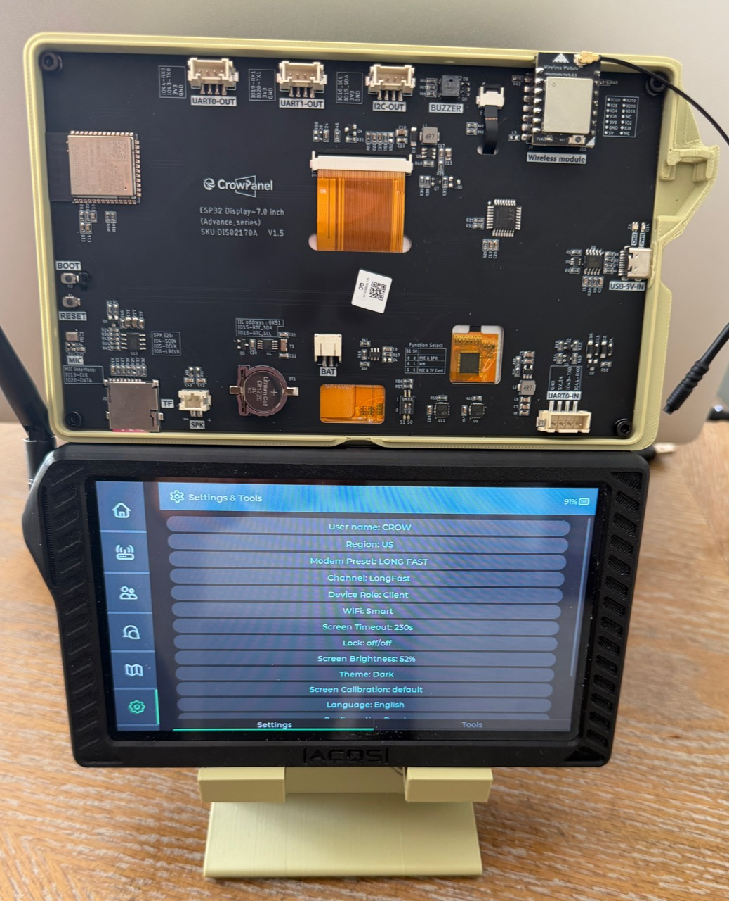

# CrowPanel Advance 4.3/5.0/7.0 ESP32-S3 v1.2+ support

This work targets the Elecrow CrowPanel Advance 4.3, 5.0, and 7.0 inch
ESP32-S3 panels, including the v1.4/v1.5 hardware family. It was developed
from Meshtastic nightly commit `3a7c49972209c7b9adbda245b0d3c1d8337fd8b1`
and tested on physical hardware.

The photo shows the v1.5 7-inch panel, installed wireless module, and the
Meshtastic Device UI running on the tested hardware.

## Working hardware and features

- SX1262 LoRa using the v1.2+ native radio-header wiring. NSS/CS is GPIO 8;
  no GPIO 0 CS jumper is required.
- STC controller at I2C address `0x30` on SDA GPIO 15 and SCL GPIO 16.
- STC-controlled display brightness and backlight power.
- GT911 touch on the shared I2C bus.
- STC buzzer at boot and for received-message notifications. The notification
  follows Meshtastic's buzzer mode and External Notification settings.
- INA219 battery monitoring at I2C address `0x40`, including battery percentage.
- A shared I2C lock for STC, touch, and INA219 traffic.
- Persisted display brightness, screen timeout, and touch calibration.
- A separate `elecrow-adv1-43-50-70-tft-v12` build target, leaving the legacy
  `elecrow-adv1-43-50-70-tft` target and its GPIO 0 radio-CS wiring unchanged.
- Hardware model 97 (`CROWPANEL`) until a distinct model is added through the
  authoritative Meshtastic protobuf repository.

The tested SX1262 pin assignment is:

| Signal | ESP32-S3 GPIO |
| --- | ---: |
| NSS/CS | 8 |
| SCK | 5 |
| MISO | 4 |
| MOSI | 6 |
| RESET | 19 |
| DIO1/IRQ | 20 |
| BUSY | 2 |

## Buzzer configuration

In the Meshtastic UI, set Device > Buzzer Mode to **All Enabled**. Under
External Notification, enable the module and Alert Message Buzzer. PWM may
remain enabled because this variant redirects the notification to the STC
controller; I2S should remain disabled. An output duration of 1000 ms provides
a clear message alert. The 250 ms default produces only a short buzz.

## Maps and SD-card status

Map handling uses the unmodified Meshtastic Device UI dependency. No build-time
source rewriting is performed. Any Google/network-only map behavior should be
implemented and reviewed in the Device UI repository before its dependency is
updated here.

SD-card initialization on the tested v1.4/v1.5 panels is still a work in
progress. Because the Meshtastic UI's Backup & Restore feature stores keys on
the SD card, that feature can remain unavailable until SD initialization is
resolved. SD-backed/offline maps are not claimed as working by this patch.

No compiled firmware is stored in this source tree. Release artifacts must be
produced by Meshtastic's normal build and release process.
