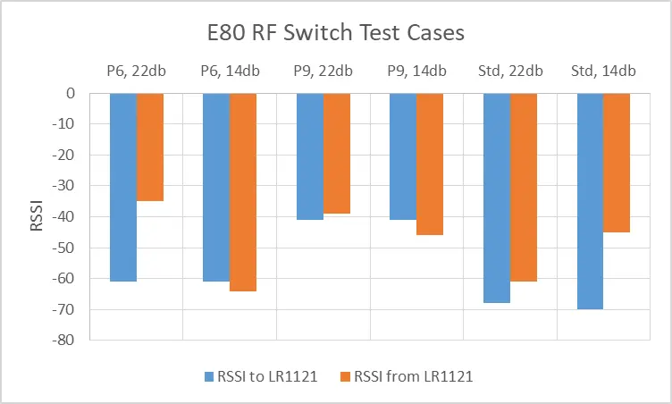

<!-- trunk-ignore-all(markdownlint/MD059) -->

# Notes

## General

The pinout is contained in the variant.h file, and a [generic schematic](./Schematic_Pro-Micro_Pinouts%202024-12-14.pdf) is located in this directory.

### Note on DIO2, RXEN, TXEN, and RF switching

Several modules require external switching between transmit (Tx) and receive (Rx). This can be achieved using several methods:

1. Link the TXEN pin on the radio module to DIO2 on the same module, and then connect RXEN on the radio module to pin 0.17 on the Pro-Micro.
2. Use DIO2 to drive a logic inverter, so that when DIO2 is `high`, RXEN is `low`, and vice versa.
3. Use DIO2 to drive a pair of MOSFETs or transistors to supply the same function.

RXEN is not required to be connected if the selected module already has internal RF switching, or if external RF switching logic is already applied.
Also worth noting that the Seeed WIO SX1262 in particular only has RXEN exposed (marked RF_SW) and has the DIO2-TXEN link internally.

<details>

<summary> The table of known modules is at the bottom of the variant.h, and reproduced here for convenience. </summary>

| Mfr          | Module           | TCXO | RF Switch | Notes                                 |
| ------------ | ---------------- | ---- | --------- | ------------------------------------- |
| Ebyte        | E22-900M22S      | Yes  | Ext       |                                       |
| Ebyte        | E22-900MM22S     | No   | Ext       |                                       |
| Ebyte        | E22-900M30S      | Yes  | Ext       |                                       |
| Ebyte        | E22-900M33S      | Yes  | Ext       | MAX_POWER must be set to 8 for this   |
| Ebyte        | E220-900M22S     | No   | Ext       | LLCC68, looks like DIO3 not connected |
| AI-Thinker   | RA-01SH          | No   | Int       | SX1262                                |
| Heltec       | HT-RA62          | Yes  | Int       |                                       |
| NiceRF       | Lora1262         | yes  | Int       |                                       |
| Waveshare    | Core1262-HF      | yes  | Ext       |                                       |
| Waveshare    | LoRa Node Module | yes  | Int       |                                       |
| Seeed        | Wio-SX1262       | yes  | Ext       | Cute! DIO2/TXEN are not exposed       |
| AI-Thinker   | RA-02            | No   | Int       | SX1278 **433mhz band only**           |
| RF Solutions | RFM95            | No   | Int       | Untested                              |
| Ebyte        | E80-900M2213S    | Yes  | Int       | LR1121 radio                          |

</details>

## LR1121 modules - E80 is the default

The E80 from CDEbyte is the most obtainable module at present, and has been selected as the default option.

Naturally, CDEbyte have chosen to ignore the generic Semtech impelementation of the RF switching logic and have supplied confusing and contradictory documentation, which is explained below.

tl;dr: The E80 is chosen as the default. **If you wish to use another module, the table in `rfswitch.h` must be adjusted accordingly.**

### E80 switching - the saga

The CDEbyte implementation of the LR1121 is contained in their E80 module. As stated above, CDEbyte have chosen to ignore the generic Semtech implementation of the RF switching logic and have their own table, which is located at the bottom of the page [here](https://www.cdebyte.com/products/E80-900M2213S/2#Pin), and reflected on page 6 of their user manual, and reproduced below:

| DIO5/RFSW0 | DIO6/RFSW1 | RF status                     |
| ---------- | ---------- | ----------------------------- |
| 0          | 0          | RX                            |
| 0          | 1          | TX (Sub-1GHz low power mode)  |
| 1          | 0          | TX (Sub-1GHz high power mode) |
| 1          | 1          | TX（2.4GHz）                  |

However, looking at the sample code they provide on page 9, the values would be:

| DIO5/RFSW0 | DIO6/RFSW1 | RF status                     |
| ---------- | ---------- | ----------------------------- |
| 0          | 1          | RX                            |
| 1          | 1          | TX (Sub-1GHz low power mode)  |
| 1          | 0          | TX (Sub-1GHz high power mode) |
| 0          | 0          | TX（2.4GHz）                  |

The Semtech default, the values are (taken from [here](https://github.com/Lora-net/SWSD006/blob/v2.6.1/lib/app_subGHz_config_lr11xx.c#L145-L154)):

<details>

```cpp
	.rfswitch = {
		.enable = LR11XX_SYSTEM_RFSW0_HIGH | LR11XX_SYSTEM_RFSW1_HIGH | LR11XX_SYSTEM_RFSW2_HIGH,
		.standby = 0,
		.rx = LR11XX_SYSTEM_RFSW0_HIGH,
		.tx = LR11XX_SYSTEM_RFSW0_HIGH | LR11XX_SYSTEM_RFSW1_HIGH,
		.tx_hp = LR11XX_SYSTEM_RFSW1_HIGH,
		.tx_hf = 0,
		.gnss = LR11XX_SYSTEM_RFSW2_HIGH,
		.wifi = 0,
	},
```

</details>

| DIO5/RFSW0 | DIO6/RFSW1 | RF status                     |
| ---------- | ---------- | ----------------------------- |
| 1          | 0          | RX                            |
| 1          | 1          | TX (Sub-1GHz low power mode)  |
| 0          | 1          | TX (Sub-1GHz high power mode) |
| 0          | 0          | TX（2.4GHz）                  |

It is evident from the tables above that there is no real consistency to those provided by Ebyte.

#### An experiment

Tests were conducted in each of the three configurations between a known-good SX1262 and an E80, passing packets in both directions and recording the reported RSSI. The E80 was set at 22db and 14db to activate the high and low power settings respectively. The results are shown in the chart below.



## Conclusion

The RF switching is based on the code example given. Logically, this shows the DIO5 and DIO6 are swapped compared to the reference design.

If future DIYers wish to use an alternative module, the table in `rfswitch.h` must be adjusted accordingly.
